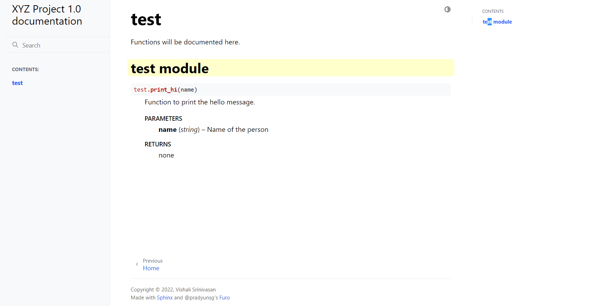

# Sphinx

# Getting started with Sphinx 

Documentation generator or a tool that translates a set of plain text source files into various output formats, automatically producing cross-references, indices, etc. Sphinx can generate a series of HTML files, a PDF file (via LaTeX), man pages and much more.

Sphinx: https://www.sphinx-doc.org/en/master/

## Sphinx setup: 

Install using pip: python -m pip install sphinx 

To check sphinx version: sphinx-build --version 

## Creating documentation layout:

Type this command in the terminal: sphinx-quickstart docs 

You will see the new docs directory.

## Make required changes under source/conf.py and source/index.rst

## Running the build 

Let’s make a first build of the docs. A build is started with the sphinx-build program: 

Syntax: sphinx-build -b html sourcedir builddir 

sphinx-build -b html C:\Project\XYZ\docs\source C:\Project\XYZ\docs\build

And finally, open docs/build/html/index.html in your browser. 

  

